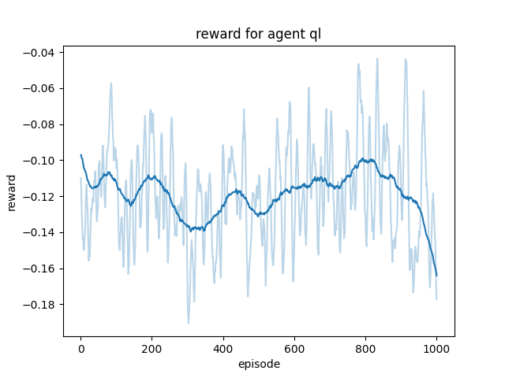

# Tutoriel : créer une IA pour Pong

## Qu'est ce que le RL?

Le Reinforcement Learning (RL) est une branche de l'apprentissage automatique qui se concentre sur la façon dont un agent peut apprendre à prendre des décisions pour maximiser une récompense dans un environnement. Contrairement à l'apprentissage supervisé où les données sont étiquetées, et à l'apprentissage non supervisé où les modèles découvrent des structures cachées, le RL implique un processus d'interaction itératif où l'agent effectue des actions, observe les résultats et ajuste sa stratégie pour obtenir de meilleures récompenses au fil du temps.

## Environnement Pong

Le jeu Pong est déjà codé; il est représenté par un objet appelé `pong.Game`. Les actions possibles sont encodées de la manière suivante :
- 0 = ne rien faire
- 1 = monter
- -1 = descendre

Notez bien que l'origine du repère (O, x, y) du jeu se trouve en haut à gauche. L'axe x pointe vers la droite et l'axe y vers le bas.

Voici les étapes pour utiliser cet objet :

```python
import pong

game = pong.Game()

while True:

    # Obtenir les actions des deux joueurs
    action1 = get_action_1()  # action est dans {-1, 0, 1}
    action2 = get_action_2()  # action est dans {-1, 0, 1}
    
    # Donner au jeu les actions
    game.control(1, action1)  # définit l'action du joueur 1
    game.control(2, action2)  # définit l'action du joueur 2

    # Calcule l'état suivant du jeu : position et vitesse des deux joueurs ainsi que de la balle
    game.compute(dt=0.1)  # dt est l'intervalle de temps pour la méthode d'Euler
```

Ici, les fonctions `get_action_1` et `get_action_2` ne sont pas encore implémentées. Elles permettront d'obtenir l'action d'un joueur (monter, descendre ou rester sur place).

Pour simplifier les deux dernières étapes, nous allons utiliser ce que l'on appelle un environnement. Cet environnement est disponible sous `pong.Env` et s'utilise de la manière suivante :

```python
import pong

env = pong.Env()

while True:

    # Obtenir les actions des deux joueurs
    action1 = get_action_1()  # action est dans {-1, 0, 1}
    action2 = get_action_2()  # action est dans {-1, 0, 1}
    
    # Effectuer une étape du jeu
    env.step(action1, action2, dt=0.1)
```

Si vous examinez le code source dans le fichier `pong/env.py`, vous verrez que la méthode `env.step` fait bien plus de choses que :

```python
game.control(1, action1)
game.control(2, action2)
game.compute(dt=0.1)
```

C'est normal, nous verrons pourquoi plus tard.

Remarquons que toutes les informations du jeu sont continues et sont contenues dans 4 variables :
- la position des deux joueurs
- la position et la vitesse de la balle

Un état sera donc représenté par un tuple `(p, op, b, vb)` où :
- p : position `y` du joueur
- op : position `y` de l'adversaire
- b : position `(x, y)` de la balle
- vb : vitesse `(v_x, v_y)` de la balle

**Inportant** : L'état sera donné par l'environnement et sera toujours normalisé de la manière suivante:
- $p \in [0, 1]$
- $op \in [0, 1]$
- $b[0] \in [0, 1]$
- $b[1] \in [0, 1]$
- $ vb[0]^2 + vb[1]^2 = 1$
## Agent Simple

Il nous reste à coder les fonctions `get_action`. Pour cela, nous allons utiliser ce que l'on appelle des agents.

**Agent** : Un agent de RL (Reinforcement Learning) est un programme informatique qui apprend à prendre des décisions en interagissant avec son environnement afin de maximiser les récompenses. Il ajuste ses actions en fonction des retours reçus pour améliorer ses performances.

Nous allons coder notre premier agent en utilisant une approche aussi simple que possible. Cet agent se contente de suivre la balle :
- Si l'agent est au-dessus de la balle, l'agent descend.
- Si l'agent est en-dessous de la balle, l'agent monte.
- Si l'agent est aligné avec la balle, il ne bouge pas.

Ouvrez le fichier `agents/simple.py`. C'est dans ce fichier que nous allons coder notre premier agent. Vous devriez voir le code suivant :

```python
from agents.super import Agent

class SimpleAgent(Agent):
    def __init__(self, name):
        Agent.__init__(self, name) # Cela permet de sauvegarder l'agent et ses performances
    
    def transform_state(self, state):
        ####write yout code here for task 1
        pass
        ####

    def act(self, state, training):
        state = self.transform_state(state)
        ####write yout code here for task 2

        ####
```

Tous les agents hériteront de la classe `Agent`. La classe `Agent` implémente la méthode `save`, qui permet de sauvegarder l'agent, ainsi qu'un moyen d'enregistrer les performances de l'agent (nous verrons cela plus tard).

La méthode `act` à pour but de remplacer la fonction `get_action`. Elle doit donc renvoyer 1, -1 ou 0 (monter, déscendre, ne pas bouger)

### Tâche 1

Tout d'abord, nous devons définir comment l'agent perçoit le jeu. En effet, la donnée brute `(p, op, b, vb)` n'est pas exploitable. Il s'agit d'un tuple de tuples avec une structure non homogène pouvant contenir des informations inutiles... En bref il faut d'abord transformer ces données.

 Nous souhaitons définir une fonction `transform_state` telle que `transform_state(p, op, b, vb)` renvoie un tuple de float, représentant ce que l'agent perçoit. Au vue de la description de l'agent nous voulons `transform_state` tel que:
`transform_state(p, op, b, vb) = (p, b[1])`
En effet, la position du joueur et la position en y de la balle sont les seules grandeurs d'intérêt.

Implémenter cette fonction dans transform_state

### Tâche 2

Complété la fonction `act` pour qu'elle retourn -1, 0 ou 1, en accord avec la description de l'agent simple.

## Boucle de jeu

Il suffit maintenant de remplacer les fonctions `get_action` par `agent.act(state, training=False)`. Mais comment obtenir la variable `state=(p, op, b, vb)` ? Eh bien, l'environnement s'occupe de ça ! Voici comment faire :

```python
import pong
import agents

env = pong.Env() #créer l'environnement

agent1 = agents.HumanAgent(player=1)  # Créer un agent controlé par les touches a et q à gauche du jeux (si player=2 alors l'agent est contrôlé par les touches p et m et se trouve à droite du jeux).
agent2 = agents.SimpleAgent(name="simple") # Créer l'agent simple codé précédement.

state1, state2 = env.reset()  # l'environnement fournit les états initiaux

run = True

while run:

    dt, run = pong.render(env)  # affiche le jeu et donne l'intervalle de temps qui s'est écoulé depuis la dernière frame. C'est important pour la physique du jeu (cf delta time sur internet)

    # Obtenir les actions des deux joueurs
    action1 = agent1.act(state1, training=False)  # action est dans {-1, 0, 1}
    action2 = agent2.act(state2, training=False)  # action est dans {-1, 0, 1}

    # Effectuer une étape du jeu
    state1, state2, _, _, done = env.step(action1, action2, dt)  # on obtient les nouveaux états
    if done:
        state1, state2 = env.reset()
```

Les méthodes `env.reset` et `env.step` renvoient deux états, state1 et state2, qui correspondent respectivement aux états des joueurs 1 et 2. La symétrie du jeu est exploitée pour que les deux agents jouent comme s'ils étaient le joueur à gauche de l'écran.

Nous verrons plus tard à quoi correspondent les variables donné par `env.step` stockées dans des `_`.

La variable `done` renvoyée par `env.step` indique si le jeu est terminé : l'un des joueurs a gagné ou le nombre d'échanges est supérieur à 25.

La fonction `pong.render` permet d'afficher le jeu à l'écran. Elle renvoie deux variables, `dt` et `run` :
- `dt` : le temps utilisé pour l'intégration d'Euler à la frame suivante. Ceci permet au jeu d'avoir la même vitesse sur tous les PC.
- `run` : `False` si l'utilisateur a demandé à fermer la fenêtre, sinon `True`.

Copiez ce code dans le fichier `exemples.py` pour vérifier que tout fonctionne correctement.

### Tâche 3

Nous voulons généraliser ce code. Ouvrez le fichier `play.py` et complétez la fonction `play(agent1, agent2)` pour qu'elle fasse jouer ces deux agents indéfiniment. Cette fonction doit afficher le jeu.

Vous pouvez désormais faire jouer des agents en utilisant le fichier `main.py`. Il vous suffit d'exécuter la commande :

```bash
python main.py play nom_agent1 nom_agent2
```

Vous pourrez observer le duel entre les deux agents !
Voici les noms d'agents acceptés :
- `human` pour contrôler l'agent avec le clavier.
- `simple` pour l'agent simple.
- Le nom d'un agent enregistré dans le dossier `agents/save` (nous aborderons ce point sous peu).

Par exemple pour jouer contre votre agent `simple` :

```bash
python main.py play human simple
```

Utilisez les touches `a` et `q` pour contôler vôtre agent.

## Q-learning

Il est maintenant temps d'aborder le cœur du sujet, c'est-à-dire l'apprentissage ! Mais qu'est-ce que nous cherchons exactement ? Eh bien, nous recherchons la politique optimale.

**politique** : En apprentissage par renforcement, le terme "politique" fait référence à la stratégie ou au plan d'action qu'un agent suit pour prendre des décisions dans un environnement donné. Une politique indique comment l'agent doit sélectionner les actions à entreprendre en fonction de l'état actuel de l'environnement.

Pour trouver cette fameuse politique nous allons utiliser l'algoritme de `Q-learning`. L'algorithme de `Q-learning` fonctionne en apprenant une fonction d'action-valeur, généralement appelée fonction `Q`, qui attribue à chaque paire `(état, action)` une valeur représentant la récompense cumulative attendue si l'agent exécute cette action dans cet état, puis suit une politique optimale par la suite.
Pour chaque état la fonction `Q` donne l'action optimale. En effet il suffit de choisir `action` dans `(-1, 0, 1)` tel que `Q(state, action)` soit maximal parmit `(Q(state, -1), Q(state, 0), Q(state, 1))`. La politique est donc représentée par la fonction `Q`.

Il nous faut maintenant une méthode pour trouver (approcher) cette fonction `Q`.

**Initialisation** : Initialisez la fonction `Q` avec des valeurs arbitraires ou nulles pour chaque paire `(état, action)`.

**Exploration et exploitation** : L'agent interagit avec l'environnement en choisissant des actions en fonction de la politique définie par `Q`.

**Mise à jour de la fonction Q** : Lorsque l'agent exécute une action dans un état donné, il reçoit une récompense de l'environnement et atteint un nouvel état. L'agent utilise ces informations pour mettre à jour la valeur `Q` de la paire `(état actuel, action)` en utilisant la formule de mise à jour `Q` :

**Mise à jour de la fonction Q** : Lorsque l'agent exécute une action dans un état donné, il reçoit une récompense de l'environnement et atteint un nouvel état. L'agent utilise ces informations pour mettre à jour la valeur `Q` de la paire `(état actuel, action)` en utilisant la formule de mise à jour `Q` :

$$
Q(s, a) = Q(s, a) + lr \cdot (r + \gamma \cdot \max(Q(s', a')) - Q(s, a))
$$

- $Q(s, a)$ : la valeur $Q$ de l'état $s$ et de l'action $a$.
- $lr$ : learning rate, contrôle l'ampleur de la mise à jour.
- $r$ : récompense obtenue en effectuant l'action $a$ dans l'état $s$.
- $\gamma$ : facteur d'escompte, prend en compte l'importance des récompenses à court terme par rapport aux récompenses à long terme ($0 < \gamma < 1$ car $\sum_{n=0}^\infty \gamma^n$ doit converger).
- $\max(Q(s', a'))$ : la valeur $Q$ maximale pour les actions possibles dans le prochain état $s'$.

Rassurez-vous, cette équation ne sort pas du chapeau. C'est l'équation de Bellman, et il a été prouvé qu'elle permet de converger vers la politique optimale. Pour plus d'informations, je vous invite à chercher `Q-learning Bellman equation` sur Internet.

Bien, beaucoup de choses ont été dites. Maintenant, comment implémenter tout ça?

### Implémentation de la fonction `Q`

Nous allons commencer par l'implémentation la plus simple de la fonction `Q`, qui est le `dictionnaire`. Plus précisément, `Q` sera un dictionnaire de dictionnaires de la forme : `q_value = Q[state][action]`. Ici, `state` est un tuple comme vu précédemment (après être passé par `transform_state`), et `action` est un entier parmi `(-1, 0, 1)`. Ainsi, `q_value` représente la récompense que l'on anticipe après avoir effectué l'action `action` dans l'état `state`.

Nous allons maintenant codé l'agent de `Q-learning`! Ouvrez le fichier `agents/qlearning.py`. Vous devriez voir:

```python
import numpy as np

from agents.super import BaseAgent

class QLearningAgent(BaseAgent):
    def __init__(self, name, lr, gamma, eps, end_eps, d_step, eps_decay):
        BaseAgent.__init__(self, name)
        self.Q = {}

        self.lr = lr
        self.gamma = gamma
        self.eps = eps
        self.end_eps = end_eps
        self.eps_decay = eps_decay

        self.d_step = d_step

        self.step = 0
    
    def discretize(self, s):
        #### Write your code here for task 9
        pass
        ####
    
    def transform_state(self, state):
        p, op, b, vb = state
        #### Write your code here for task 4

        ####

        #### Write your code here for task 9

        ####

    def learn(self, state, action, reward, next_state, done):
        state = self.transform_state(state)
        next_state = self.transform_state(next_state)

        self.check_q_value(state)
        self.check_q_value(next_state)

        self.push(reward, done) # Saves reward, it is a methode of BaseAgent (see agents/super.py).

        #### Write yout code here for task 7

        ####

    def act(self, state, training):
        state = self.transform_state(state) # transform the state in something usable

        self.check_q_value(state) # if the state is not in self.Q, add it.


        #### Write your code here for task 9

        ####

        #### Write yout code here for task 6

        ####
    
    def check_q_value(self, state):
        #### Write yout code here for task 5
        pass
        ####
```

Le dictionnaire `Q` est accessible avec l'attribut `self.Q`. 

### Tâche 4

Commençons par coder la méthode `transform_state` qui va définir comment notre agent perçoit le monde. Pour rappel, la méthode `transform_state` prend le paramètre `state` sous la forme `state = (p, op, b, vb) = (p, op, (b_x, b_y), (vb_x, vb_y))` et doit renvoyer un `tuple` de `floats` (et/ou `int`). Gardez à l'esprit que réduire au minimum l'information donnée à l'agent facilitera son apprentissage. Avec tout cela en tête, complétez la méthode `transform_state`.

### Tâche 5

Nous voyons que le dictionnaire est initialement vide, nous avons donc besoin d'un moyen de le remplir. Pour faire ceci, compléter la méthode `check_q_value` de la manière suivante:
- si `state` n'est pas dans `Q` alors ajouter le en associant à chaque action une récompense nulle.
- si `state` est déjà dans `Q`, ne rien faire.

Ici, il est considéré que state a déjà été traité par la fonction `transform_state`. Cela implique que state est un `tuple` de `floats`, ce qui en fait un type hashable et donc parfaitement valide en tant que clé de dictionnaire.

### Tâche 6

La dernière étape facile ! Codons la méthode `act` de notre agent. Pour rappel, `act` doit, en se basant sur l'état fourni par `transform_state`, fournir l'action à entreprendre parmi `(-1, 0, 1)`. Un dernier rappel, l'action à prendre dans un état est celle qui a la plus grande `q-value` dans le dictionnaire `Q[state]`. Maintenant, complétez la méthode `act`.

### Tâche 7

Nous y voilà enfin ! Il est temps de coder la partie d'apprentissage de cet agent. Cette phase consiste essentiellement à implémenter l'équation de Bellman dans la méthode `learn`. Pour rappel, voici l'équation en question, qui permet de mettre à jour les valeurs du dictionnaire `Q` :

$$
Q(s, a) = Q(s, a) + lr \cdot (r + \gamma \cdot \max(Q(s', a')) - Q(s, a))
$$

Les variables correspondantes aux paramètres de la méthode `learn` sont les suivantes :
- $s$ = `state`
- $a$ = `action`
- $r$ = `reward`
- $s'$ = `next_state`

On rappelle que:
- $Q(s, a)$ = `Q[state][action]`

Il reste les valeurs de $lr$, $\gamma$ et $a'$, et voici comment y accéder :
- $lr$ = `self.lr`.
- $gamma$ = `self.gamma`.
- $a'$ = `(-1, 0, 1)` (On veut le $\max$ de $Q(s', \cdot )$ sur $a'$)

Maintenant que tout cela est clair (j'espère), implémentez ceci dans la méthode `learn`. Notez que cette fonction ne doit rien retourner, elle doit juste modifier la valeur de `self.Q[state][action]`.

**Important** : Pour les états finaux (`done = True`) l'équation s'écrit:

- $Q(s, a) = r$

## Boucle d'entrainnement

Il est temps de coder ce qui entraînera nos agents ! Croyez-le ou non, il suffit de modifier un peu votre code pour la fonction `play`, qui doit ressembler à ceci :


```python
import pong

def play(agent1, agent2):
    ####write yout code here for task 3
    env = pong.Env()
    state1, state2 = env.reset()

    run = True
    while run:

        dt, run = pong.render(env) # affiche le jeux et donne l'interval de temps qui c'est écoulé depuis la dernière frame. C'est important pour la physique du jeux (cf delta time sur internet)

        # Obtenir les actions des deux joueurs
        action1 = agent1.act(state1, training=False)  # action est dans {-1, 0, 1}
        action2 = agent2.act(state2, training=False)  # action est dans {-1, 0, 1}

        # Effectuer une étape du jeu
        state1, state2, reward1, reward2, done = env.step(action1, action2, dt) # on obtient les nouveaux états
        
        if done:
            state1, state2 = env.reset()
    ####
```

Oui, c'est une correction de la tâche 3 à la seule différence de ces deux variables `reward1` et `reward2`. 

Et oui, l'environnement donne aussi des récompenses ! Pour modifier les valeurs de ces récompenses, rendez-vous dans `pong/env.py` et modifiez les premières lignes :

```python
#### learning Parameters ####

touch_reward = 1 #reward given each time the player touches the ball
win_reward = 5 #reward given when the player won
loss_reward = -10 #reward given when the player lost
skip = 1 # agent makes a decision each skip step

#### learning Parameters ####
```

Revenons à nos moutons. Ouvrez le fichier `train.py`, qui doit ressembler à ceci : 

```python
import pong

def train(agent1, agent2, episode):

    env = pong.Env()
    state1, state2 = env.reset()

    for e in tqdm(range(episode), desc="training"): # for the progress bar.
    #### write yout code here for task 8
        pass
    ####
```

La boucle `for` s'arrête une fois que `episode` parties ont été jouées.

### Tâche 8

Complétez la fonction `train` pour qu'elle entraîne `agent1` et `agent2` en les faisant jouer l'un contre l'autre pendant `episode` parties. Il suffit de compléter le code dans la boucle `for` :
- Chaque itération de la boucle `for` correspond à une partie.
- Une partie s'arrête uniquement lorsque la variable `done` fournie par l'environnement est `True` (la condition de la boucle `while` de `play` doit donc être modifiée).
- Notez que `env.step` renvoie le `next_state`, vous devez conserver en mémoire `state`.
- Pour chaque agent, la méthode `learn` doit être appelée après `env.step` et avec les informations que `env.step` fournit (c'est-à-dire `reward` et `next_state`).
- Une fois que la méthode `learn` a été exécutée, vous pouvez remplacer `state` par `next_state` (c'est-à-dire `state = next_state`).

Nous sommes maintenant prêts à entraîner notre modèle ! Pour commencer, créons un agent :

```bash
python main.py create agent_type agent_name
```

Par exemple pour créer un agent `QLearning` avec le nom `ql` :

```bash
python main.py create ql ql
```

Cette commande crée un agent de type `ql` (QLearning) avec le nom `ql`. Cet agent devrait être sauvegardé dans `agents/save/ql`.

Pour entraîner vos agents, utilisez la commande suivante :

```bash
python main.py train agent1 agent2 ... agentn -e number_of_episodes_per_round -r number_of_rounds
```

Par exemple, pour entraîner `ql` contre `simple` pendant `10,000` épisodes, exécutez la commande suivante :

```bash
python main.py train ql simple -e 10_000
```

Cela ne devrait pas prendre plus que quelques secondes ! Maintenant que notre agent est bien entraîné, nous pouvons vérifier la récompense qu'il a reçue pour chaque épisode en utilisant la commande suivante :

```bash
python main.py reward agent1 agent2 ... agentn
```

Dans notre cas :

```bash
python main.py reward ql
```




Eh bien, c'est une grande déception ! Il semblerait que notre agent n'ait rien appris...

Pour comprendre ce qu'il se passe, exécutez la commande suivante :

```bash
python main.py info ql
```

Pour ma part j'obtient:
```bash
size = 45.2 MB
...
```

On remarque que le dictionnaire de notre agent est gigantesque : il contient beaucoup trop d'états.

## Discrétisation

Pour réduire le nombre d'états, la solution est assez simple : nous allons discrétiser l'espace. Retournez dans le fichier `agent/qlearning.py`, qui devrait ressembler à ça :


 ```python
 import numpy as np

from agents.super import BaseAgent

class QLearningAgent(BaseAgent):
    def __init__(self, name, lr, gamma, eps, end_eps, d_step, eps_decay):
        BaseAgent.__init__(self, name)
        self.Q = {}

        self.lr = lr
        self.gamma = gamma
        self.eps = eps
        self.end_eps = end_eps
        self.eps_decay = eps_decay

        self.d_step = d_step

        self.step = 0
    
    def discretize(self, s):
        #### Write your code here for task 9
        pass
        ####
    
    def transform_state(self, state):
        #### Write your code here for task  4
        p, op, b, vb = state
        s = (p-b[1],)
        ####

        #### Write your code here for task 9

        ####

        return s

    def learn(self, state, action, reward, next_state, done):
        state = self.transform_state(state)
        next_state = self.transform_state(next_state)

        self.check_q_value(state)
        self.check_q_value(next_state)

        self.push(reward, done)

        #### Write your code here for task 7

        max_next_q = max(self.Q[next_state].values())
        if done:
            self.Q[state][action] = reward
        else:
            self.Q[state][action] += self.lr * (reward + self.gamma * max_next_q - self.Q[state][action])
        
        ####

    def act(self, state, training):
        self.step += 1

        state = self.transform_state(state) # transform the state in something usable
        self.check_q_value(state) # if the state is not in self.Q, add it.

        #### Write your code here for task 10
        
        ####
        
        #### Write your code here for task 6

        action_q_values = self.Q[state]
        return max(action_q_values, key=action_q_values.get)
    
        ####
    
    def check_q_value(self, state):
        #### Write your code here for task 5
        if state not in self.Q:
            self.Q[state] = {1 : 0, -1 : 0, 0 : 0}
        ####
 ```

 ### Tâche 9

 Dans la méthode `discretize`, discrétisez un tuple de nombres flottants quelconques `s` avec le pas `self.d_step`. Utilisez la formule suivante pour discrétiser un nombre réel `x` avec un pas `d` : `y = int(x / d) * d`. Cette méthode doit donc renvoyer un `tuple` de même longueur que son paramètre. Une fois cette fonction implémentée, appelez-la dans la méthode `transform_state` pour transformer l'état continu `s` en état discret. `transform_state` doit renvoyer cet état discret.

 **Important** : Compter bien le nombre d'état possible ! Ce nombre dépend uniquement de votre implémentation de `transform_state`. Idéalement, rester proche de `1,000` états.

 Pour calculer le nombre d'états :
 - Calculer le nombre de valeur possible par chaque élément du `tuple`
 - Le produit de ces valeurs donne le nombre d'état

 **Exemple** : On considère `transform_state(state) = (p-b[1], b[0], vb[0], np.sign(vb[1]))` avec le `d_step` par défault : `d_step = 0.01`:
 - $p-b[1] \in [-1, 1]$ donc $n_1 = \dfrac{2}{0.01} = 200$
 - $b[0] \in [0, 1]$ donc $n_2 = \dfrac{1}{0.01} = 100$
 - $vb[0] \in [-1, 1]$ donc $n_3 = \dfrac{2}{0.01} = 200$
 - $np.sign(vb[1]) \in \{-1, 0, 1\}$ donc $n_4 = 3$

 Le nombre d'états est donc $n = n_1 \cdot n_2 \cdot n_3 \cdot n_4 = 12 \cdot 10^6$.

 Il y a beaucoup trop d'états ! Il existe plusieurs méthode pour réduire le nombre d'états tout en gardant les mêmes variables.

 **Exemple** : On considère `transform_state(state) = (np.clip(p-b[1], -0.2, 0.2), b[0]/40, vb[0]/40, np.sign(vb[1]))` avec le `d_step` par défault : `d_step = 0.01`:
 - $np.clip(p-b[1]) \in [-0.2, 0.2]$ donc $n_1 = \dfrac{0.4}{0.01} = 40$
 - $b[0]/40 \in [0, \dfrac{1}{40}]$ donc $n_2 = \lfloor \dfrac{1}{40*0.01} \rfloor = 2$
 - $vb[0]/40 \in [\dfrac{-1}{40}, \dfrac{1}{40}]$ donc $n_3 = \dfrac{2}{40 * 0.01} = 5$
 - $np.sign(vb[1]) \in {-1, 0, 1}$ donc $n_4 = 3$

 Le nombre d'états est donc $n = n_1 \cdot n_2 \cdot n_3 \cdot n_4 = 1200$.

Notez que `vb[0]` et `np.sign(vb[1])` donne toute l'information sur `vb` car $vb[0]^2+vb[1]^2 = 1$.

Vous pouvez aussi changer `d_step` à la création de votre agent:

```bash
python main.py create agent_type agent_name -d 0.01
```


## Un peu d'aléatoire

Une partie importante de l'apprentissage d'un agent réside dans l'exploration de l'espace des états possibles. Pendant la phase d'entraînement, on souhaite que l'agent choisisse parfois une action au hasard pour explorer différentes possibilités.

Au début de son apprentissage, l'agent ne sait rien, donc le hasard doit jouer un rôle important. Après un nombre considérable d'actions, nous pouvons diminuer l'importance du hasard afin de nous concentrer sur les actions qui ont une bonne valeur `Q`.

 ### Tâche 10

 Lors des premières parties d'entrainement nous voulons explorer l'environnement avec des actions aléatoires. Pour implémenter ceci, modifier la méthode `act` tel que: si `training=True` et `np.random.random() < (self.eps - self.end_eps) * np.exp(-self.eps_decay * self.step) + self.end_eps` alors l'agent choisit une action aléatoirement.

Ceci permet à l'agent d'agir de manière aléatoire au début de l'entraînement. Après un nombre d'étapes assez grand, il commencera à utiliser la politique `Q` avec une probabilité de `1 - self.end_eps`. En d'autres termes, il explorera davantage au début et se concentrera progressivement sur la politique apprise.

 Il me reste une dernière amélioration dans la pôche : choisir la bonne action si elle ont toutes la même `q_value`.

 ### Tâche 11

 Ouvrez `agent/qlearning.py` et modifier la méthode `act` tel que si toutes les `q_value` d'un état sont les mêmes alors l'agent choisit une action avec une distribution uniforme.

## Evaluation du QLearning

Maintenant que tout cela est implémenté, nous pouvons constater que notre agent apprend beaucoup mieux :
```bash
 python main.py create ql ql
 python main.py train ql simple -e 5_000
 python main.py reward ql
 ```
 
Essayez maintenant de jouer contre cet agent :
 ```bash
 python main.py play human ql
 ```
Normalement, vous parvenez toujours à le vaincre sans trop de difficulté. Peut-être que nos hyperparamètres ne sont pas adaptés à l'apprentissage ? Je vous encourage à expérimenter avec différents paramètres. Par exemple :
 ```bash
python main.py create ql ql1 -lr 0.1
python main.py create ql ql2 -lr 0.0001
python main.py train simple ql1 ql2 -e 1000 -r 2
 ```
 **Attention** : Cette commande peut prendre un certain temps. En effet, nous souhaitons entraîner 3 agents pendant 2 `rounds`, où chaque match se compose de `1,000` `épisodes`. Cela équivaut à `3` matchs de `1,000` `épisodes` pour chacun des `2` `rounds`, soit un total de `6,000` `épisodes`.

 Pour déterminer quel agent a obtenu le meilleur résultat :
 ```bash 
 python main.py reward ql1 ql2
 ```

Nous constatons qu'un faible taux d'apprentissage `lr` est préférable. Vous pouvez poursuivre les comparaisons avec les hyperparamètres (cette étape peut être très longue, vous pouvez choisir de la sauter) :
- `gamma` (le $\gamma$ de l'équation de `Bellman`):
```bash
python main.py create ql ql1 -gamma 0.9
python main.py create ql ql2 -gamme 0.99
python main.py train simple ql1 ql2 -e 1000 -r 2
python main.py reward ql1 ql2
 ```
- `eps` (Probabilité de choisir une action au hasard au début de l'entrainement) :
```bash
python main.py create ql ql1 -eps 0.8
python main.py create ql ql2 -eps 0.2
python main.py train simple ql1 ql2 -e 1000 -r 2
python main.py reward ql1 ql2
```
- `eeps` (Probabilité de choisir une action au hasard après un grand nombre d'actions) :
```bash
python main.py create ql ql1 -eeps 0.8
python main.py create ql ql2 -eeps 0.2
python main.py train simple ql1 ql2 -e 1000 -r 2
python main.py reward ql1 ql2
 ```
- `edecay` (Décroissance exponentiel pour passer de `eps` à `eeps`) :
```bash
python main.py create ql ql1 -edecay 0.1
python main.py create ql ql2 -edecay 0.00001
python main.py train simple ql1 ql2 -e 1000 -r 2
python main.py reward ql1 ql2
 ```
- `d` (Pas de la discrétisation) :
```bash
python main.py create ql ql1 -d 0.1
python main.py create ql ql2 -d 0.01
python main.py train simple ql1 ql2 -e 1000 -r 2
python main.py reward ql1 ql2
 ```
Voici la comparaison pour le dernier paramètre `d` :

Cela met en évidence l'importance de ce paramètre. Ici, nous constatons que si la valeur de `d` est trop élevée, le nombre d'états devient trop restreint et l'agent ne parvient pas à apprendre quoi que ce soit.

Nous pouvons même observer quand les agents `ql1` et `ql2` ont joué l'un contre l'autre lors de l'entraînement avec les variations de la récompense (`reward`) pour `ql2`. Lorsque cette récompense est très élevée, `ql1` et `ql2` s'entrainent l'un contre l'autre.

Il reste un problème... Pour que nôtre agent soit vraiment efficace il est nécessaire de l'entrainer pendant très très longtemps. En effet avec cette implémentation de la fonction `Q`, notre agent doit être passé par tous les états possibles plusieurs fois lors de sont entrainement. Ceci n'est pas vraiment faisable en un temps raisonnable.

Pour régler ce problème nous allons nous tourner vers les réseaux de neuronnes !

## Deep-QLearning

Nous allons étudier une autre implémentation de la fonction `Q`, les réseaux de neuronnes profonds. Voici la topologie d'un réseaux de neuronnes pour un agent dont la méthode `transform_state` renvoie un `tuple` de `n` `float`:
- input layer : `n` neuronnes.
- hidden layers : peut être nimporte quoi.
- output layer : `3` neuronnes (pour `up`, `down` et `nothing`).

Si `state` est le `tuple` donné par `transform_state` alors avec cette implémentation `Q(state) = q_values` où:
- `q_values[0]` : `q_value` estimée si l'agent décend (`action=-1`).
- `q_values[1]` : `q_value` estimée si l'agent reste sur place (`action=0`).
- `q_values[2]` : `q_value` estimée si l'agent monte (`action=1`).

Nous allons tout de suite définir nôtre première topologie ! Ouvrez `network/topology.py`, vous devez voir ceci :

```python
import torch.nn as nn


class DQN_1(nn.Module):
    
    def __init__(self, n_inputs):
        nn.Module.__init__(self) # Tell torch that this class is a neural network

        #### Write your code here for task 12
        
        ####
    
    def forward(self, x):
        #### Write your code here for task 12
        pass
        ####
```

### Tâche 12

Complétez `__init__` et `forward` pour que cette class représente un réseaux de neuronnes tel que:
- nombre d'entrers = `n_inputs`
- nombre de sorties = `3`